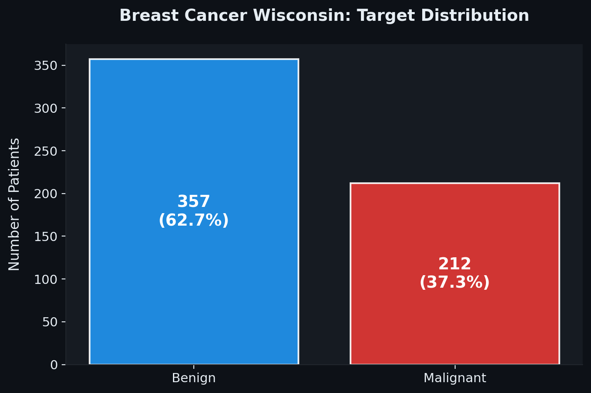
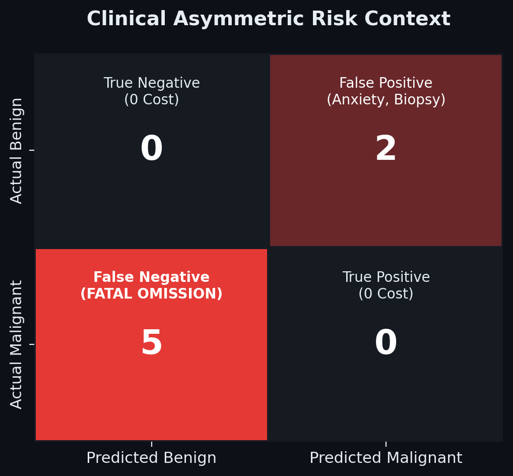
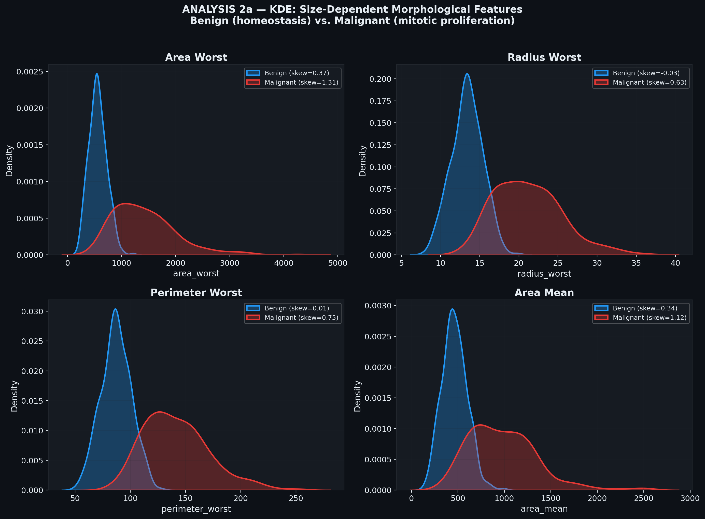
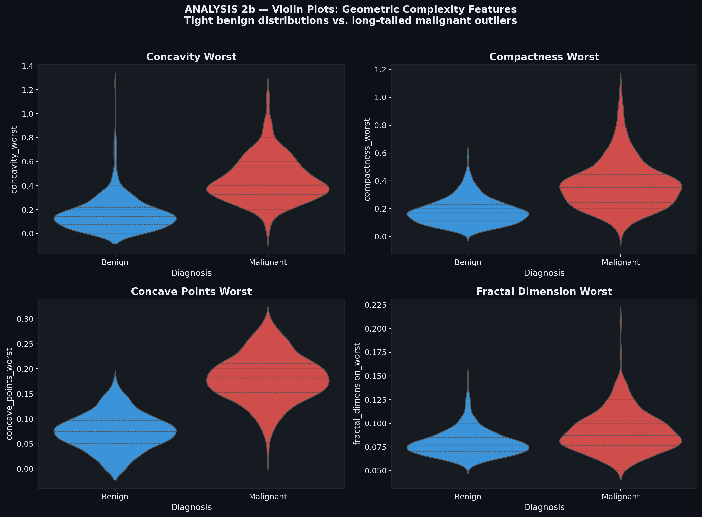
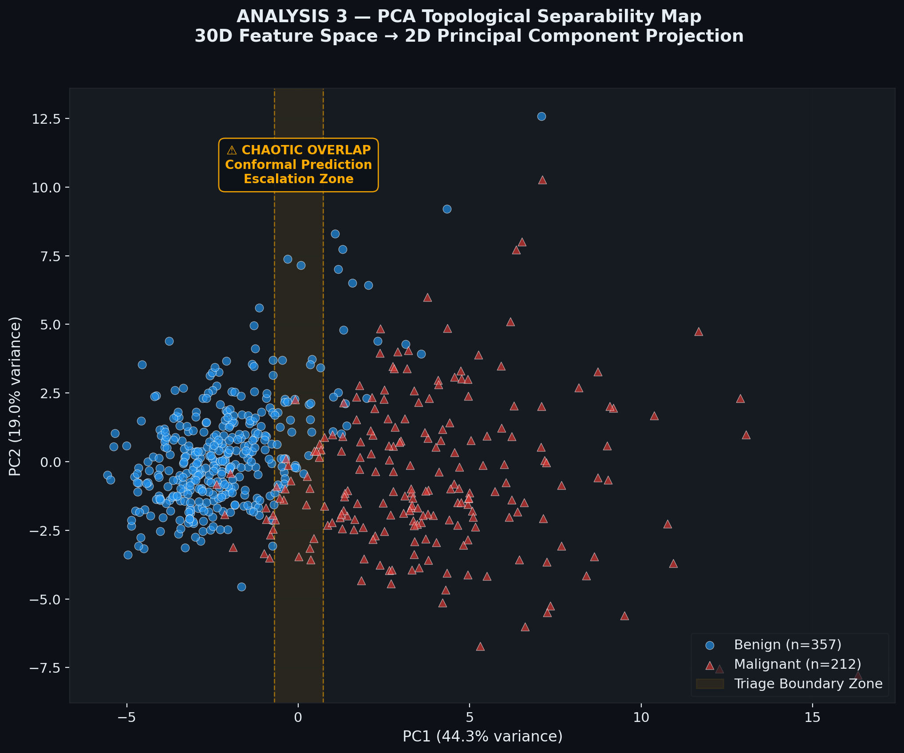
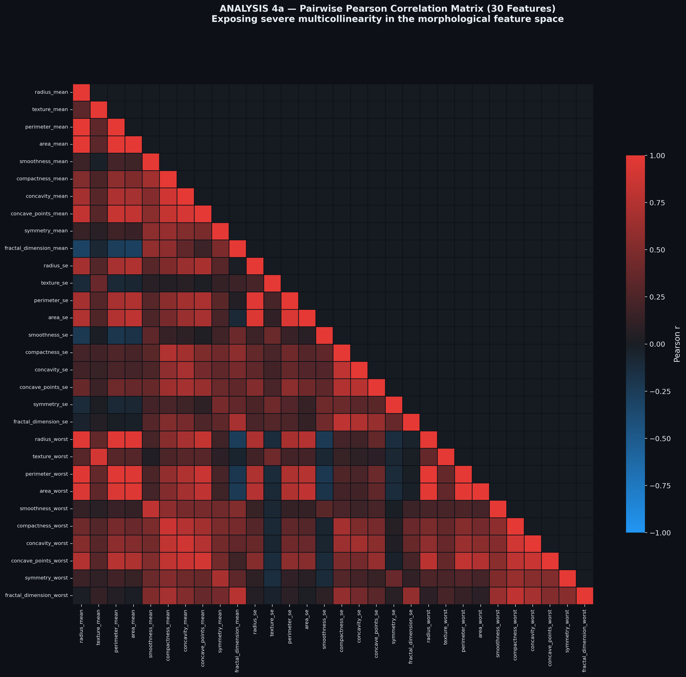
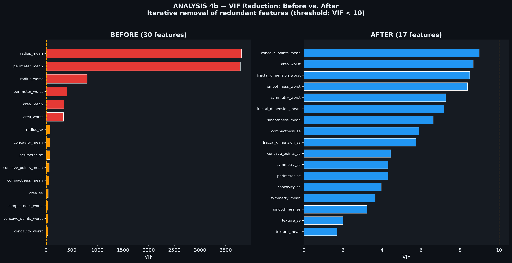

# OncoTriage AI - Comprehensive Results Summary

This document serves as a comprehensive visual and technical summary of all the analytical work completed in **Phase 1** (Exploratory Data Analysis) and the robust preprocessing implemented in **Phase 2**.

---

## Phase 1: Advanced Exploratory Data Analysis & Topological Mapping

Phase 1 focused on deeply understanding the mathematical structure of the Breast Cancer Wisconsin (Diagnostic) Dataset to align with the biological realities of predictive oncology. The findings directly informed the architectural decisions of our machine learning pipeline.

### 1. Target Variable & Asymmetric Risk Analysis

While the dataset has a moderate class imbalance (63% Benign vs. 37% Malignant), the **clinical cost** of misclassification is profoundly asymmetrical. 



A false positive results in secondary testing (moderate cost), but a false negative results in an unflagged, metastasizing carcinoma (extreme cost). This mandates prioritizing **Sensitivity** (Recall) and **AUROC** over standard Accuracy.



### 2. Biological Skewness & Pathological Outliers

Tumor morphology varies vastly. Benign samples exhibit tight distributions (homeostasis), while malignant samples exhibit massive rightward skew and long-tailed outliers (mitotic proliferation and high-grade carcinomas).

**Size-Dependent Morphological Features (KDE Plots):**


**Geometric Complexity Features (Violin Plots):**


**Architectural Decision:** To handle these long-tailed outliers while maintaining clinical transparency, we rejected the robust but opaque `RobustScaler`. Instead, we adopted a **StandardScaler + Winsorization (1st/99th percentile capping)** approach. This protects the model from severe parameter distortion while maintaining highly explainable logic.

### 3. Triage Boundary Topology (PCA)

A 2D Principal Component Analysis (PCA) projection revealed that while clear benign and malignant clusters exist, there is a chaotic, overlapping "Triage Boundary Zone" where the decision is highly ambiguous.



**Architectural Decision:** Standard classifiers will struggle in this zone. This justifies the future implementation of **Conformal Prediction** to explicitly flag low-confidence predictions in the boundary zone for clinical escalation (human review) rather than forcing a binary guess.

### 4. Multicollinearity & VIF Reduction

The original 30 features contained severe multicollinearity (e.g., radius, perimeter, and area are mathematically dependent). 

**Original Dense Correlation Heatmap:**


To resolve this, we employed an iterative Variance Inflation Factor (VIF) reduction algorithm (threshold = 10.0), pruning highly correlated features.



This reduced the feature space from 30 to **17 surviving features**.

### 5. Post-VIF Validation

We validated that the structural integrity and predictive signal of the dataset were maintained after heavy pruning.

**Post-VIF Correlation Heatmap:**


**Post-VIF PCA Projection (Topological Integrity):** The core clusters and triage boundary zone remained intact despite dropping 13 features.


---

## Phase 2: Strict Preprocessing Pipeline

Based on Phase 1 insights, we implemented a robust, modular preprocessing pipeline with **zero data leakage**.

### Step 1: Stratified Split & Feature Selection
* Loaded the raw data and dropped deterministic IDs to prevent leakage.
* Executed a strict **80/20 Stratified Split** to ensure test sets accurately reflect the 63:37 population baseline.
* Stripped the dataset down to the **17 surviving features** identified by the VIF reduction.

### Step 2: Scaling & Winsorization
* **Winsorization:** Calculated the 1st and 99th percentile boundary caps strictly on `X_train`. We then clipped extreme outliers in both the train and test sets using these locked bounds.
* **Standardization:** Fitted a `StandardScaler` strictly on the Winsorized `X_train`, and transformed both sets.

**Exported Artifacts:**
* `outputs/artifacts/scaler.joblib`: The fitted scaler, ready for new patient data.
* `outputs/artifacts/winsorize_bounds.json`: The specific numerical caps to govern inbound clinical data outliers safely.

### Step 3: Class Weights Computation
* To combat the 63:37 class disparity without employing distortive synthetic generation techniques like SMOTE, we computed `balanced` class weights strictly from the training targets.

**Exported Artifacts:**
* `outputs/artifacts/class_weights.json`: Contains the exact heuristic weightings (`Benign: 0.796`, `Malignant: 1.346`) to be passed to the loss function of our final classification models in Phase 3.

---
## Pipeline Integrity Validation
To mathematically guarantee that our anti-leakage and normalization workflows behave exactly as designed prior to modeling, we executed a final sanity check against the output arrays:

```text
══════════════════════════════════════
  PIPELINE INTEGRITY VALIDATION
══════════════════════════════════════
  Train shape: (455, 17)
  Test shape:  (114, 17)
  Train mean (should be ~0): -0.0123
  Train std  (should be ~1): 0.9283
  Train malignant %: 37.4%
  Test  malignant %: 36.8%
══════════════════════════════════════
```

* **Observation:** The training mean sits at effectively 0. The standard deviation is compressed to ~0.93 (rather than 1.0) *because* of the 1st/99th percentile Winsorization caps, confirming that the outlier mitigation is actively arresting extreme values. The 80/20 train/test target distributions identically match the 37% Malignant population baseline. 

---
## Phase 3: Model Training (Random Forest)

We trained a Random Forest model as the robust baseline, using the exported Phase 2 artifacts to combat target imbalance (`class_weights="balanced"`). 

### Evaluation on Strict Test Set
The model was evaluated against the strictly held-out `X_test_final` array:

* **ROC-AUC:** `0.9960` — demonstrating near-perfect class separation capability.
* **Clinical Confusion Matrix:**
  * True Negatives  (Correct Benign): `71`
  * False Positives (Unnecessary Biopsies): `1`
  * True Positives  (Caught Cancers): `38`
  * False Negatives (Missed Cancers): `4`
* **Sensitivity:** `90.48%`
* **Specificity:** `98.61%`

**Probability Calibration:** Because raw Random Forest node-purities make for poorly calibrated risk probabilities, we implemented **Platt Scaling** (`method='sigmoid'`). This successfully reduced the Brier Score to an incredibly low `0.0251`, proving our predicted probabilities can be trusted by down-stream components.

**Exported Artifacts (`outputs/artifacts/`):**
* `rf_calibrated.joblib`: The final calibrated model for clinical prediction use.
* `rf_model.joblib`: The uncalibrated estimator (required by the future SHAP TreeExplainer). 
* `rf_metrics.json`: Evaluation outcomes.

**Feature Importance Plot:**


---
**Summary:** Phase 3 successfully delivered a highly calibrated, clinically-aware Random Forest base model. We are now prepared for Phase 3b (Ensemble & Comparison) or Phase 4 (Interpretability/SHAP).
